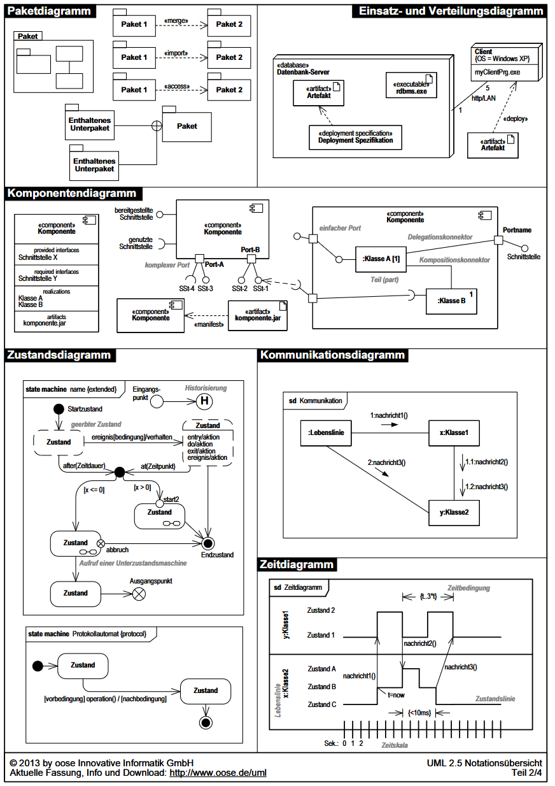
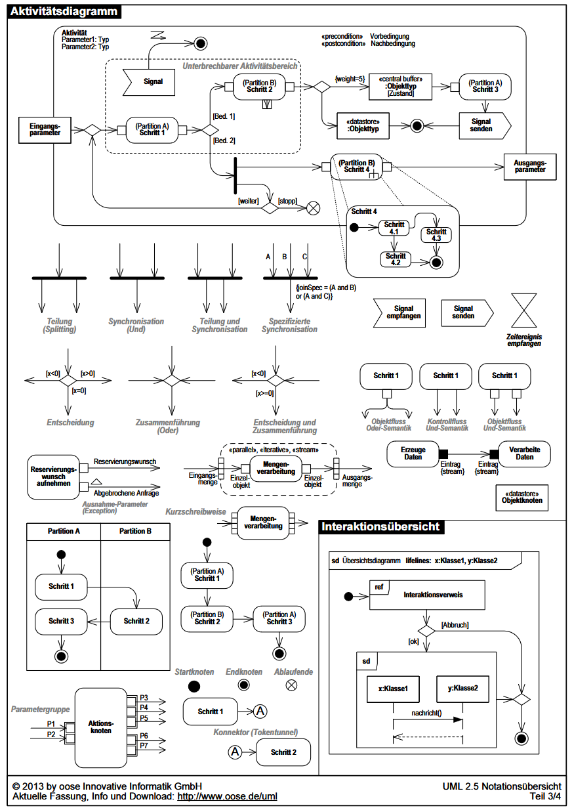
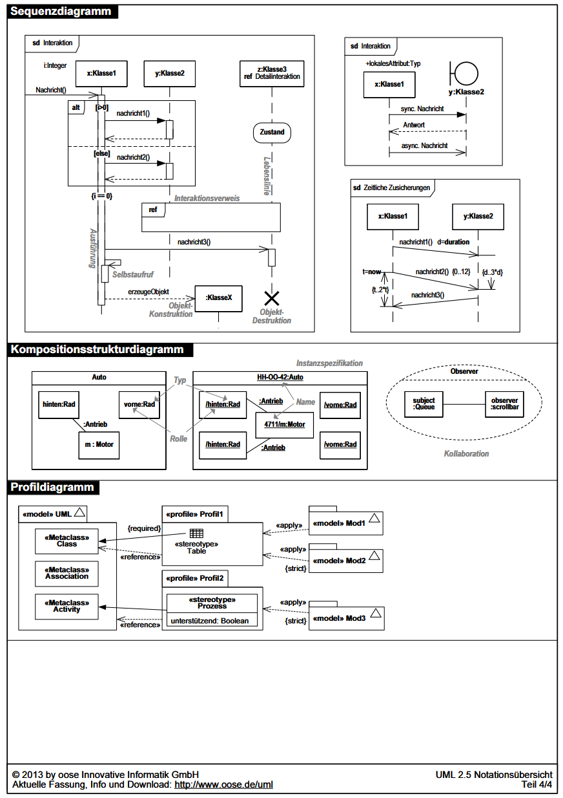

# Systemanalyse

## UML - Unified Modelling Language

## UML - Diagramme

### Struktur Diagramme
- Klassendiagramm
    - Zeigt, wie Klassen (z. B. Mensch, Auto) aufgebaut sind, welche Eigenschaften sie haben und wie sie miteinander verbunden sind.
- Objektdiagramm
    - Zeigt ein konkretes Beispiel, wie Objekte (z. B. "Anna" als Mensch, "VW Golf" als Auto) und deren Beziehungen zu einem bestimmten Zeitpunkt aussehen.
- Komponentendiagramm
    - Zeigt, wie die Software in Bausteine (z. B. Dateien oder Module) zerlegt ist und wie diese zusammenarbeiten.
- Verteilungsdiagramm
    - Zeigt, wie Software auf verschiedenen Computern oder Geräten verteilt wird und wie diese miteinander verbunden sind.
- Kompositionsdiagramm
    - Beschreibt, wie die einzelnen Teile einer Klasse oder eines Systems intern zusammenarbeiten.
- Paketdiagramm
    - Gruppiert Klassen und andere Elemente in Pakete, um das System übersichtlicher zu machen.
- Profildiagramm
    - Fügt spezielle Anpassungen und Erweiterungen zu UML hinzu, um bestimmte Anforderungen oder Branchen besser darzustellen.

### Verhaltensdiagramme
- Use-Case-Diagramm
    - Zeigt, was das System für die Nutzer (z. B. Kunden, Administratoren) leisten soll. Es wird verwendet, um die funktionalen Anforderungen eines Systems zu spezifizieren.
- Aktivitätsdiagramm
    - Modelliert den Ablauf von Prozessen oder Workflows. Es wird verwendet, um detaillierte Verhaltensabläufe und logische Abfolgen darzustellen.
- Zustandsdiagramm
    - Zeigt, in welchen Zuständen ein Objekt sein kann (z. B. "an", "aus") und was diese Zustände verändert.
- Interaktionsdiagramme
    - Sequenzdiagramm
        - Zeigt, wie Objekte in der Reihenfolge miteinander kommunizieren, z. B. wer wann wem eine Nachricht sendet.
    - Kommunikationsidagramm
        - Stellt die Interaktionen zwischen Objekten in Form von Nachrichtenflüssen dar, jedoch ohne zeitliche Reihenfolge. Es wird verwendet, um die Struktur der Kommunikation zu analysieren.
    - Interaktionsübersichtdiagramm
        - Kombiniert Aktivitätsdiagramme mit Interaktionen, um komplexe Interaktionsszenarien darzustellen. Es wird für die Planung und Organisation von Interaktionsabläufen verwendet.
    - Timingdiagramm
        - Beschreibt zeitliche Veränderungen von Zuständen oder Werten in einem System. Es wird verwendet, um Echtzeitanforderungen oder zeitkritische Abläufe zu modellieren.