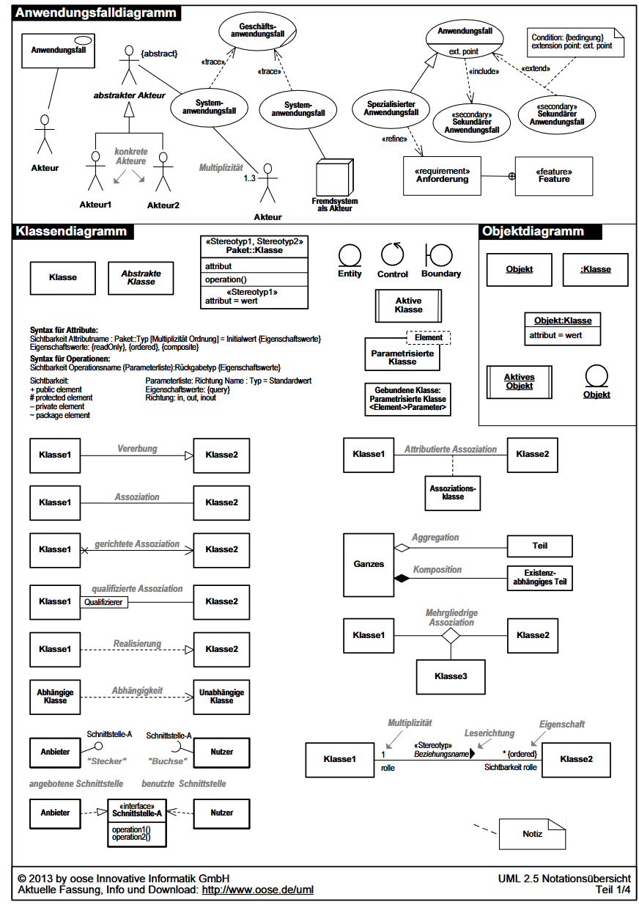

# Systemanalyse

## UML - Unified Modelling Language

## UML - Diagramme

### Struktur Diagramme
- Klassendiagramm
- Objektdiagramm
- Komponentendiagramm
- Verteilungsdiagramm
- Kompositionsdiagramm
- Paketdiagramm
- Profildiagramm

### Verhaltensdiagramme
- Use-Case-Diagramm
- Aktivitätsdiagramm
- Zustandsdiagramm
- Interaktionsdiagramme
    - Sequenzdiagramm
    - Kommunikationsidagramm+
    - Interaktionsübersichtdiagramm
    - Timingdiagramm