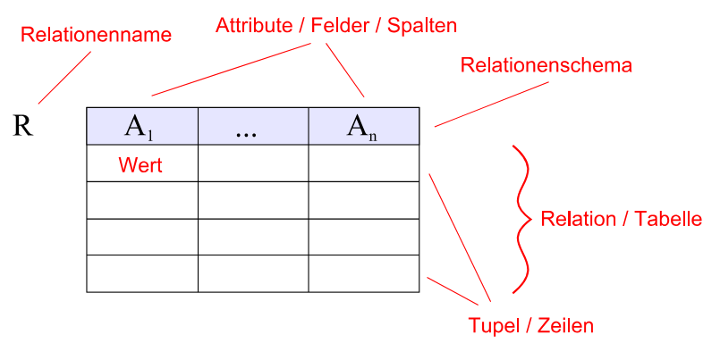
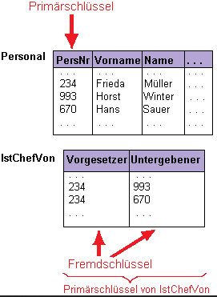

# Begriffe zu Datenbanken

- Datenbank-Modelle
	- **hierarchische Datenbank**: Ältestes Datenbankmodell, basiert auf Baumstruktur. Unflexibel daher veraltet.
	- **relationale Datenbank**: Meistgenutztes Datenbank-Modell, basiert auf Tabellen
	- Es gibt laut Wikipedia **fünf** weitere Datenbank-Modelle, welche 
	selten verwendet werden.

- Eine **relationale Datenbank** ist eine Sammlung von Tabellen (auch Relationen genannt).
- Jede **Tabelle** besteht aus Datensätzen (Zeilen / Tupel), welche Felder (Spalten / Attribute) enthalten.
- Jeder **Datensatz** innerhalb einer Tabelle besitzt **alle** definierten Felder!

- Eine Relation kann einen oder mehrere Schlüssel (`key`) haben, über welche Datensätze schnell gefunden und selektiert werden können. Schlüssel werden in Indices verwaltet.
- Ein **Schlüssel** (`key`) kann aus einem oder aus mehreren Feldern gebildet werden.
- Eine Besonderheit ist der **Primärschlüssel** (`primary key`).  Er muss für jeden Datensatz eindeutig sein. Er wird oft zur Verknüpfung mit anderen Tabellen eingesetzt.
- Als **Fremdschlüssel** bezeichnet man ein Feld, in dem der Primärschlüsselwert einer anderen Tabelle eingetragen ist. Damit werden Verknüpfungen zwischen verschiedenen Tabellen realisiert.

#### Quellen

- https://de.wikipedia.org/wiki/Datenbankmodell
- https://de.wikipedia.org/wiki/Relationale_Datenbank
