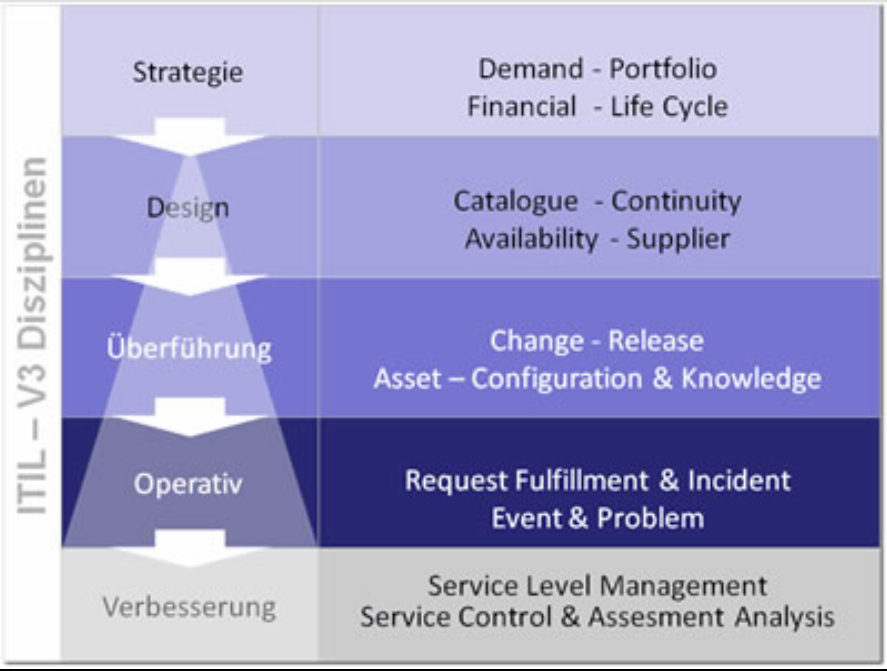

#IT Service Management nach ITIL

ITSM steht für _**IT** **S**ervice **M**anagement_ und wird üblicherweise als "ITSM nach ITIL" verstanden. Dabei ist **ITIL** inzwischen das Standard-Framework für IT-Betrieb.

ITIL organisiert alle Aufgaben in sogenannte Services zur Erfüllung eines Geschäftszwecks. 

- Der _Customer_ bestellt und benötigt den Service. Er bestimmt, **was** der Service leistet.
- Der _Provider_ liefert den Service bzw. stellt ihn bereit. Er bestimmt, **wie** der Service realisiert wird.
- Der _Service_ wird in einer Servicevereinbarung ([SLA](https://en.wikipedia.org/wiki/Service-level_agreement)) definiert. Die Erbringung des Services wird durch Messung der (im SLA vereinbarten Kennzahlen (KPI) überprüft und gesteuert.
- Das Ganze funktioniert mehrstufig:
	- Ein _Service Provider_ benötigt für die Bereitstellung seines Services die Dienste anderer Einheiten bzw. Firmen. Gegenüber seinen Lieferanten ist er dann selbst der _Service Customer_.
- ITSM unterstützt Outsourcing- aber auch Insourcing-Prozesse ganz gut, da durch die Service-Struktur klare Zuständigkeiten (WAS <-> WIE), Schnittstellen und Leistungsvereinbarungen (SLAs bzw. OLAs) getroffen werden, die sowohl für externe als auch für interne Partner gelten können.
	- das klassische ITIL unterscheidet zwischen externen Providern (SLA) und internen Providern (OLA). In der Praxis ist diese Unterscheidung aber irrelevant.

SLA -> Service Level Agreement -> Leistungsvereinbarung mit einem (externen) Provider.  
OLA -> Operations Level Agreement -> Leistungsvereinbarung mit einem internen Provider.   
KPI -> Key Performance Indicator -> Kennzahl, welche das Ergebnis bzw. die Qualität eines Services misst. Der Begriff wird analog zum KPI der Betriebswirtschaftslehre verwendet.

#### ITIL v3 Struktur

> Die nachfolgende Aufzählung muss man nicht auswendig können. Sie dient lediglich der Anschauung, welche Themen in welchem der fünf ITIL-Bücher behandelt werden.

- _Service Strategy_
	- Strategiefindung
	- Finanzmanagement
	- Serviceprotfoliosteuerung
	- Nachfragesteuerung
- _Service Design_
	- Servicekatalog-Management
	- Service Level Management
	- Kapazitätsmanagement
	- Verfügbarkeitsmanagement
	- IT-Service-Notfallmanagemement
	- Informationssicherheits-Management  &larr;
	- Lieferantenmanagement
- _Service Transition_
	- Inbetriebnahmeplanung und -unterstützung
	- Änderungsmanagement (IT Change Management)
	- Asset- & Configuration Management
	- Release Management (Versionierung, Übername in Betrieb)
	- Serviceüberprüfung und Testmanagement
	- Wissensmanagement
- _Service Operation_
	- Event Management (Behandlung automatischer Ereignisse)
	- Incident Management (Behebung von Störungen)
	- Problem Management (ursächliche Beseitigung von Problemen)
	- Request Fulfillment (Erfüllen von Anwenderanfragen)
	- Access Management (Benutzer- und Zugriffsverwaltung)
- _Continual Service Improvement_
	- der siebenstufige Verbesserungsprozess
	- Servicemessung
	- Serviceberichterstattunh

#### Quellen

- [ITIL v3 Buchtitel](https://de.wikipedia.org/wiki/ITIL#Buchtitel_der_ITIL-Publikationen)
- [Service Level Agreement nach IBM](https://www.ibm.com/de-de/topics/service-level-agreement)

