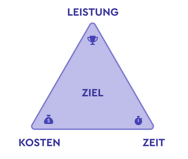

# Projektmanagement

Ein Projekt hat  **drei** Eigenschaften: **Ziel**, **Beginn** und **Ende**. Fehlt eine der Eigenschaften, dann ist es kein Projekt.

**Projektmanagement** ist die Lehre von der geordneten Planung und Durchführung von Projekten. Es gibt hierzu mehrere Standards:

- **IPMA** ist der europäische und vor allem deutsche Quasi-Standard für geordnetes Projektmanagement. 
- **PRINCE2** ist eng verwandt mit ITIL und hat denselben Ursprung. PRINCE2 ist hauptsächlich im angloamerikanischen Raum verbreitet. PRINCE2 konzentriert sich auf die 'harten' Projektthemen (u.a. formale Organisation und Dokumentenstruktur) und verweist ansonsten auf den PMBOK-Guide.
- **PMBOK** (Project Management - Body of Knowledge) ist der Projektmanagement-Standard des PMI und ist weltweit anerkannt. der PMBOK-Guide beschreibt umfassend die verschiedenen Methoden des Projektmanagement.  Das PMBOK-Modell ist im Grundsatz prozessorientiert.
- Die DIN-Normenreihe **DIN 69901** beschreibt **Grundlagen, Prozesse, Prozessmodell, Methoden, Daten, Datenmodell und Begriffe im Projektmanagement**. Unter dem Haupttitel Projektmanagement; Projektmanagementsysteme enthält diese Normenreihe fünf Teile 

## Das magische Dreieck

Besonders im deutschsprachigen Raum ist das **„Magische Dreieck“** als Symbol für drei zentrale Faktoren des [Projektmanagements](https://www.factro.de/blog/projektmanagement/) bekannt. Bei den Faktoren handelte es sich um **Zeit, Kosten und Leistung** (auch Zeit, Kosten, Ergebnis/Qualität). Das Ziel bzw. der Erfolgsfaktor positioniert sich dabei in der Mitte des Dreiecks.

- **Zeit**: Die **Dimension Zeit** steht für die [Zeitplanung](https://www.factro.de/blog/zeitplan-erstellen/) und beeinflusst die Einteilung der anderen beiden Werte. Die Zeit steht dabei auch, aber nicht nur, **für Start- und Enddatum des Projekts**, sondern auch für zwischenzeitliche Termine oder **wichtige Meilensteine**.
- **Kosten**: Die **Dimension Kosten** beziffert die finanziellen Aufwände und das verfügbare Budget für das gesamte Projekt. Dieses sollte vor dem Start feststehen und nicht überschritten werden, damit **Projekte wirtschaftlich bleiben**. Hierfür eignet sich die [Kostenplanung](https://www.factro.de/blog/kostenplanung/) vor Projektbeginn.
- **Leistung**: Unter der **Dimension Leistung** werden die gewünschten Ergebnisse zusammengefasst, die nach dem [Projektabschluss](https://www.factro.de/blog/projektabschluss/) erreicht sein sollen. Die Ziele sollten dabei nach der [SMART-Formel](https://www.factro.de/blog/smart-ziele/) aufgebaut und mit allen Projektbeteiligten, Entscheidungsträgern und Stakeholdern besprochen sein.
## Phasen des Projektmanagements 

(aus TIMO24.DE)

- Projektphasen strukturieren den Produktlebenszyklus in klar definierte Abschnitte, die systematisch auf den Projekterfolg hinarbeiten.
- Die klassischen 4 Phasen (Initiierung, Planung, Umsetzung, Abschluss) sind weit verbreitet, doch es gibt auch erweiterte Modelle mit 5 oder 7 Phasen.
- Eine gründliche Projektinitiierung legt den Grundstein für alle weiteren Phasen, indem Ziele und Anforderungen klar definiert werden.

###### Die Prozessgruppen nach PMBOK entsprechen den angefragten Projektphasen

|PMBOK-Prozessgruppen|Beschreibung|
|---|---|
|Initiierungsprozessgruppe|Die Prozesse die durchgeführt werden um ein neues Projekt bzw. eine neue Phase eines bestehenden Projekts zu definieren, indem die Freigabe eingeholt wird, dieses Projekt bzw. diese Projektphase zu beginnen.|
|Planungsprozessgruppe|Die Prozesse, die erforderlich sind, um den Inhalt und Umfang des Projekts zu bestimmen, die Ziele genauer zu formulieren und die Vorgehensweise festzulegen, um die Ziele des Projekts zu erreichen.|
|Ausführungsprozessgruppe|Solche Prozesse, die durchgeführt werden, um die im [Projektmanagementplan](https://de.wikipedia.org/wiki/Projektplan "Projektplan") definierte Arbeit abzuschließen und die Projektziele zu erreichen.|
|Überwachungs- und Steuerungsprozessgruppe|Die Prozesse, die zur Verfolgung, Prüfung und Regulierung des Fortschritts und der Leistung des Projekts erforderlich sind und mit denen ggf. notwendige Änderungen des Plans erkannt und entsprechende Korrekturmaßnahmen ergriffen werden können.|
|Abschlussprozessgruppe|Die Prozesse, die durchgeführt werden, um das Projekt, die Phase oder den Vertrag formell abzuschließen oder zu beenden.[[7]](https://de.wikipedia.org/wiki/PMBOK-Guide#cite_note-7)|

#### Anfrage
- Grundlagen Projektmanagement
- Initialisierungs- bzw. Definitionsphase
- Planungsphase
- Durchführungsphase
- Abschlussphase
- Change-, Risiko- und Teammanagement
- Agiles Projektmanagement

> *Die Anfrage ist etwas schwierig zu bearbeiten. Grundsätzlich gibt es für das klassische Projektmanagement mehrere etablierte, aber unterschiedliche Vorgehensmodelle, die sich bezüglich der Phasen teilweise erheblich unterscheiden. Nimmt man dann noch die agilen Projektmanagementmethoden hinzu, wird das Ganze noch unübersichtlicher. Mal sehen, wie sich das strukturieren lässt.*

#### Quellen

- <https://de.wikipedia.org/wiki/Projektmanagement>
-  <https://de.wikipedia.org/wiki/PMBOK-Guide>
- <https://www.timo24.de/blog/lexikon/projektphasen-im-projektmanagement/>
- <https://de.wikipedia.org/wiki/DIN_69901>
- <https://www.factro.de/blog/magisches-dreieck/>
