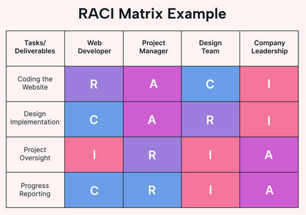

# RACI

RACI ist die Abkürzung aus den Begriffen _**R**esponsible, **A**ccountable, **C**onsulted, **I**nformed_ und ist eine Technik zur Analyse und Darstellung von Verantwortlichkeiten. Üblicherweise werden Verantwortlichkeiten im Unternehmen in einer **RACI-Matrix** erfasst, welche die Zuordnung von Rollen zu den Aufgaben abbildet.

- _**R**esponsible_: zuständig für die Durchführung bzw. Ausführung
- _**A**ccountable_: Gesamtverantwortung. *Es gibt nur ein **A** für jede Aufgabe!*
- _**C**onsulted_:  Diese Rolle ist nicht direkt beteiligt, muss aber gefragt werden
- _**I**nformed_: Diese Rolle muss informiert werden.

#### Quellen

- _Responsible, Accountable, Consulted, Informed_, Technik zur Analyse und Darstellung von Verantwortlichkeiten, siehe [RACI](https://de.wikipedia.org/wiki/RACI "RACI")
